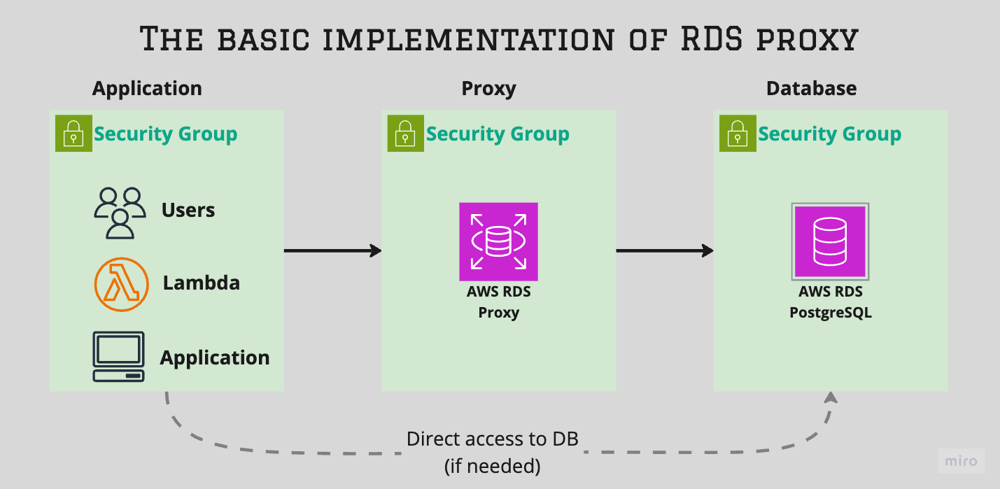
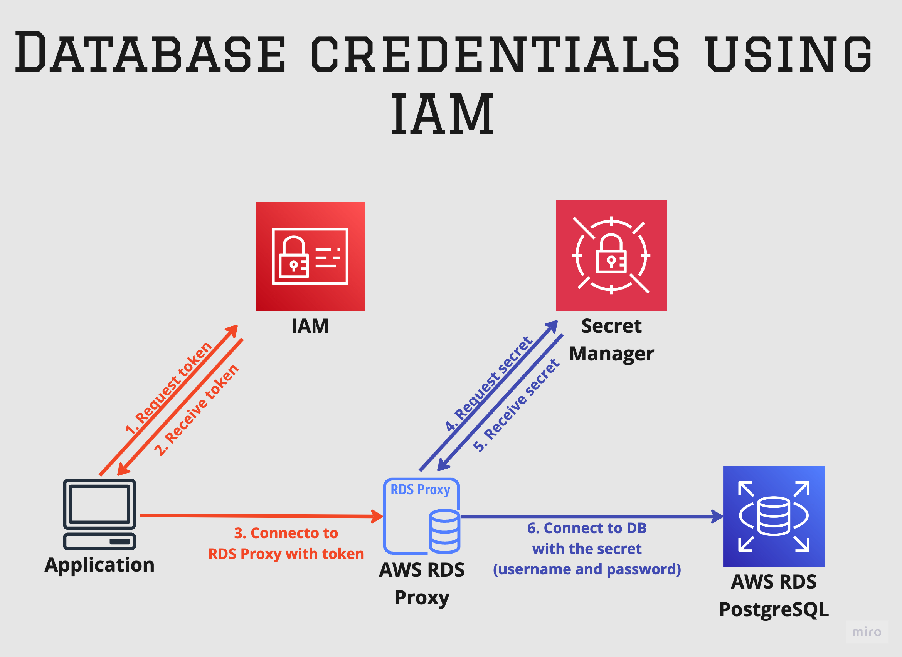

# RDS Proxy for Aurora/RDS PostgreSQL

###  ℹ️ **INFO:** For testing popruse, you can use an [example](rds-proxy-deploying-test/deploy.md) of deployment a test RDS Proxy.


Table of Contents
1.	[Overview](#overview)  
2.	[Configuration](#configuration)  
    - [Pooler section](#pooler-options)  
    - [Authentication section](#authentication-options)  
    - [Security section](#security-options)  
3.	[Multiplexing and Pinned Connections](#multiplexing-and-pinned-connections)  
4.	[Monitoring](#monitoring)  
5.	[Pros and Cons](#pros-and-cons)  
6.	[Pricing](#pricing)  
7.	[Additional Resources](#additional-resources)  

## Overview


This overview does not compare RDS Proxy and other poolers. It is only focused on describing RDS Proxy so that readers can compare it on their own with other open-source connection poolers.


### How it works
RDS Proxy maintains a pool of database connections in a “ready-to-use” state. It continuously monitors these connections, refreshing or creating new ones as necessary. Note that RDS Proxy manages the number of connections it keeps in the server pool automatically, based on the current workload (DBAs do not have the ability to control this). When a **transaction** request is made (RDS Proxy supports only transactional mode), the proxy retrieves a connection from the pool and uses it to execute the transaction. 
By default, connections are reusable after a transaction, a process known as multiplexing, meaning the same connection may be used by different, unrelated components. This ability to reuse connections for multiple transactions increases RDS Proxy’s efficiency, enabling it to handle more connections than the database typically supports. Ultimately, RDS Proxy scales as required, with the database’s limitations becoming the bottleneck.
RDS Proxy makes applications more resilient to database failures by automatically connecting to a standby DB instance while preserving application connections.

RDS Proxy has a few configurable parameters, which are grouped into the sections below. 

### Configuration

#### Pooler options
- **Idle client connection timeout**: The amount of time a client connection can remain idle before the proxy disconnects it. The minimum is 1 minute and the maximum is 8 hours.
- **Connection pool maximum connections**: This parameter is a percentage of the maximum DB connection limit, controlling how many connections RDS Proxy can establish with the database.
- **Connection borrow timeout**: The timeout for borrowing a DB connection from the pool. It’s similar to pgbouncer’s [query_wait_timeout](https://www.pgbouncer.org/config.html#query_wait_timeout) parameter.
- **Initialization query**: A list of SQL statements to set up the initial session state for each connection.

#### Authentication options
- **Secrets Manager secrets**: List of users' secrets which allow to connect to RDS Proxy
- **Client authentication type**: Supports MD5 or SHA-256 authentication methods for client connections to the proxy.
- **IAM authentication**: You can use IAM authentication to connect to the proxy, **in addition** to specifying database credentials. 
  - **Not Allowed**: Clients can connect without IAM authentication using secrets to access both RDS Proxy and PostgreSQL.
  - **Required**: Clients must use IAM authentication to connect to RDS Proxy and a secret to connect to the database. The diagram below illustrates how this mode works 



#### Security options
- **Require Transport Layer Security**: Enforces the use of TLS for connections between **RDS Proxy and the database**, ensuring that all traffic between them is encrypted. 

Additionally, TLS can also be enforced between **the application and RDS Proxy** by [specifying the required settings](https://docs.aws.amazon.com/AmazonRDS/latest/UserGuide/rds-proxy.howitworks.html#rds-proxy-security.tls) on the client side (--ssl-mode). To download the TLS certificate for RDS Proxy, use this [link](https://www.amazontrust.com/repository/). 

## Multiplexing and Pinned Connections
As mentioned earlier, RDS Proxy uses transactional multiplexing to efficiently manage connections to the database. However, certain operations in your application can cause connections to become **pinned**, meaning they are dedicated exclusively to a single client session and cannot be shared with other sessions. This reduces the effectiveness of connection pooling because pinned connections cannot be reused by other clients until they are unpinned.

### Conditions That Cause Pinning
Connections become pinned when the application performs operations that require session-level state to be maintained across multiple transactions. Common actions that cause pinning include:
 - **Using Temporary Tables**: Creating or manipulating temporary tables within a session.
 - **Session-Level Variables**: Modifying or relying on session variables or settings.
 - **Prepared Statements**: Using certain types of prepared statements that persist across transactions.
 - **Specific SQL Features**: Utilizing features like cursors, advisory locks, or other session-dependent functions.

You can find the full list of conditions that cause pinning for RDS for PostgreSQL in the AWS [documentation](https://docs.aws.amazon.com/AmazonRDS/latest/UserGuide/rds-proxy-pinning.html#rds-proxy-pinning.postgres).

#### Impact of Pinned Connections
A high number of pinned connections can significantly degrade the performance benefits of RDS Proxy. Since pinned connections cannot be shared, the proxy’s ability to efficiently multiplex connections is reduced

When you consider the opportunity to use RDS Proxy for a client, it’s essential to research their workload to determine if there are conditions that could cause a large number of pinned connections. A significant number of pinned connections can negate all the advantages of using RDS Proxy. Therefore, understanding the application’s behavior and adjusting it to minimize pinned connections is critical for successful implementation.

Fortunately, AWS provides a metric for the number of pinned connections, which you can monitor.

A high number of pinned connections can significantly degrade the performance benefits of RDS Proxy because they cannot be shared, reducing the proxy’s ability to efficiently multiplex connections. When considering RDS Proxy for a client, it’s essential to analyze their workload to identify conditions that might cause many pinned connections, as this can negate its advantages. Understanding and adjusting the application’s behavior to minimize pinned connections is critical for successful implementation. Fortunately, AWS provides a metric for monitoring the number of pinned connections.


## Monitoring
- CloudWatch collects the metrics for RDS Proxy such as:
    - DatabaseConnectionsBorrowLatency: The time in microseconds that it takes for the proxy being monitored to get a database connection.  
    - DatabaseConnectionsCurrentlyBorrowed: The current number of database connections in the borrow state.  
    - DatabaseConnectionsCurrentlySessionPinned: The current number of database connections currently pinned because of operations in client requests that change session state.  
    - DatabaseConnections: The current number of database connections.  
    - ClientConnections: The current number of client connections.  
    
    [The full list of RDS Proxy metrics](https://docs.aws.amazon.com/AmazonRDS/latest/UserGuide/rds-proxy.monitoring.html).  
- AWS provide 'activate enhanced logging' which enables detailed logging for monitoring and troubleshooting porpuse. 
    This is a way how track a pin connections:
    ```text
    2024-10-12T17:20:40 [WARN] [proxyEndpoint=default] [clientConnection=2125203372] The client session was pinned to the database connection [dbConnection=1953961465] for the remainder of the session. The proxy can't reuse this connection until the session ends. Reason: SQL changed session settings that the proxy doesn't track. Consider moving session configuration to the proxy's initialization query. Digest: "set search_path to $1,$2,$3".
    ```


## Pros and Cons

### Pros
1. **Integrated with AWS Ecosystem**: RDS Proxy is fully managed by AWS and seamlessly integrates with RDS and Aurora databases, eliminating the need to deploy and manage additional infrastructure как в примере с pgbouncer где нужно высокой домтупности нужно использовать несколько Instances и задейстовать дополнительно Load Balancer.
2. **Reduced Downtime During Failovers and Switchover**: RDS Proxy can  reduce downtime in case of an instance failure or switchover during minor upgrade. It maintains client connections during failovers, reducing application disruptions.
  - In standard RDS PostgreSQL **Multi-AZ DB Instance**, the switchover process takes approximately 20–40 seconds, primarily due to DNS endpoint changes.
  - RDS Proxy can reduce failover time to around 10-15 seconds by using internal connections and avoiding the wait for DNS changes. 
  - In **RDS Multi-AZ DB cluster** switchover typically occurs within 35 seconds, but with RDS Proxy it can be reduced up to 1 seconds.
  
  > ℹ️ **INFO:** 
  > The same fast switchover can be achieved on **RDS Multi-AZ DB cluster** with Pgbouncer as well if Pgbouncer is patched (the patch hasn’t been tested by Data Egret) by [AWS patch](https://github.com/awslabs/pgbouncer-fast-switchover). [Read more](https://aws.amazon.com/blogs/database/fast-switchovers-with-pgbouncer-on-amazon-rds-multi-az-deployments-with-two-readable-standbys-for-postgresql/)

3. **Better Scaling**: Efficiently handles spikes in application traffic by pooling and reusing connections, preventing the database from being overwhelmed by connection requests.

### Cons
1. **VPC-Only Access**: RDS Proxy can be used only within a Virtual Private Cloud (VPC) and cannot be publicly accessible from the internet.
2. **Limited Configuration Options**: Offers limited configurability, providing few parameters for modification compared to other connection poolers like pgbouncer.
3. **Additional Cost**: RDS Proxy is not free. AWS charges for its usage based on the number of vCPUs of the database instance. [See the Pricing section](#pricing) for details.


## Pricing
For detailed pricing information, refer to the [AWS RDS Proxy Pricing](https://aws.amazon.com/rds/proxy/pricing/).

- Aurora Serverless v2: $0.015 per ACU hour
- Provisioned Instances: $0.015 per vCPU hour (with a minimum charge for 2 vCPUs)

```text
Example:
If you are running an Amazon RDS PostgreSQL t2.small database instance that has 1 vCPU and have enabled the proxy, you will be charged for the minimum of 2 vCPUs at $0.030 per hour for the proxy ($0.015 per vCPU hour × 2 vCPUs).

For a 30-day month, your bill would be:
   • Total vCPU hours: 2 vCPUs × 24 hours/day × 30 days = 1,440 vCPU hours
   • Total Cost: $0.015 per vCPU hour × 1,440 vCPU hours = $21.60
```

---- 

## Additional Resources
* [Using Amazon RDS Proxy](https://docs.aws.amazon.com/AmazonRDS/latest/UserGuide/rds-proxy.html)
* [Using TLS/SSL with RDS Proxy](https://docs.aws.amazon.com/AmazonRDS/latest/UserGuide/rds-proxy.howitworks.html#rds-proxy-security.tls)
* [Using Amazon RDS Proxy with AWS Lambda](https://aws.amazon.com/blogs/compute/using-amazon-rds-proxy-with-aws-lambda/)
* [Amazon Relational Database Service Proxy FAQs](https://aws.amazon.com/rds/proxy/faqs/)
* [AWS RDS Proxy Deep Dive: What is it and when to use it](https://www.learnaws.org/2020/12/13/aws-rds-proxy-deep-dive/)
* [IAM database authentication for MariaDB, MySQL, and PostgreSQL](https://docs.aws.amazon.com/AmazonRDS/latest/UserGuide/UsingWithRDS.IAMDBAuth.html)
* [Setting up database credentials in AWS Secrets Manager for RDS Proxy](https://docs.aws.amazon.com/AmazonRDS/latest/UserGuide/rds-proxy-secrets-arns.html)
* [Fast switchovers with PgBouncer on Amazon RDS Multi-AZ deployments with two readable standbys for PostgreSQL
](https://aws.amazon.com/blogs/database/fast-switchovers-with-pgbouncer-on-amazon-rds-multi-az-deployments-with-two-readable-standbys-for-postgresql/)

## What should be tested
1. The speed of switchover between RDS Proxy and Open-Source solution in **RDS Multi-AZ DB cluster** mode. 
2. Connection to RDS Proxy using TLS 
3. Connection to RDS Proxy using IAM auth
