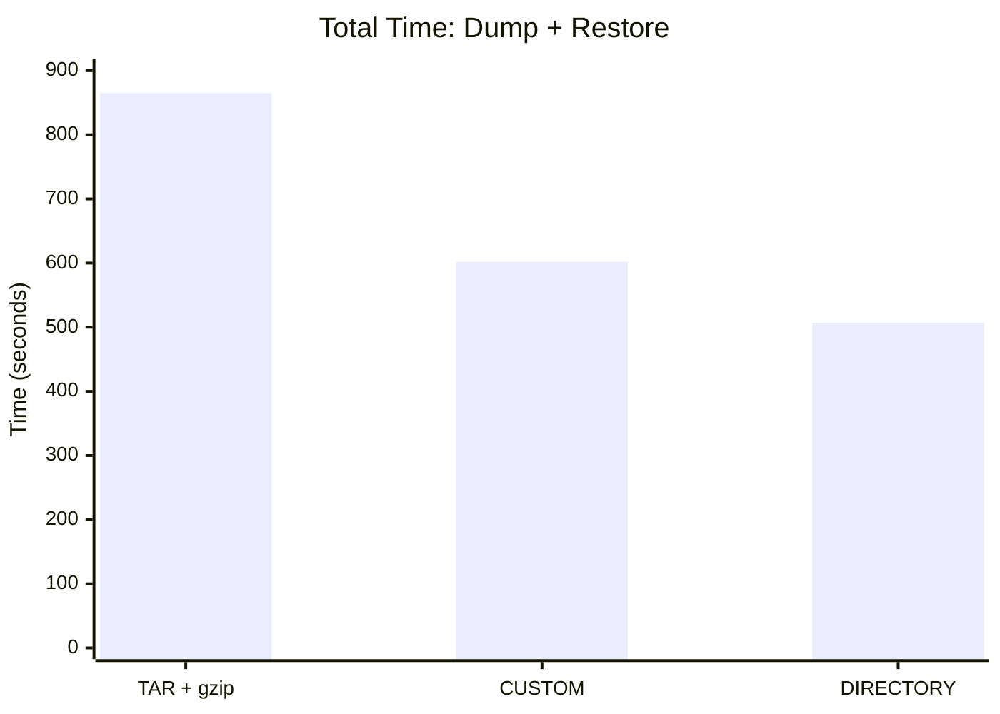

When it comes to PostgreSQL backups, choosing the right dump format can significantly impact both backup and restore times. This guide explores the practical differences between TAR, CUSTOM, and DIRECTORY formats based on real-world testing.

> ⚠️ **Important:** pg_dump creates logical backups (SQL-level export), not physical backups. It should not replace a proper backup strategy using tools like pg_basebackup, WAL-G, or pgBackRest, which could provide point-in-time recovery and are essential for production environments.

<!--MORE-->

-----

## Table of Contents

- [Introduction](#introduction)
- [How pg_dump Works](#how-pg_dump-works)
- [Test Environment](#test-environment)
- [Performance Comparison](#performance-comparison)
- [Format Characteristics](#format-characteristics)
- [Selective Restoration](#selective-restoration)
- [Practical Recommendations](#practical-recommendations)
- [Commands Reference](#commands-reference)
- [Conclusion](#conclusion)

## Introduction

pg_dump is the standard tool for creating logical backups in PostgreSQL. It supports several output formats, each with its own trade-offs between convenience, speed, and flexibility. Understanding these differences helps you choose the optimal format for your specific use case.

> **Note:** Roles and tablespaces are not included in pg_dump output. Use `pg_dumpall --roles-only` to back up roles separately.

## How pg_dump Works

When pg_dump runs, it sends a `COPY` command to PostgreSQL. The server then streams the requested data back to pg_dump. The key difference between formats lies in how this data is transmitted and processed:

- **TAR format:** Data is sent as TEXT. Each value must be converted from binary to text representation, escaped if necessary, and formatted. This produces more data and consumes more CPU cycles.

- **CUSTOM/DIRECTORY formats:** Data is sent in binary format. Integers remain as 4-8 bytes, timestamps stay compact, and no text conversion overhead occurs.

This explains why TAR is consistently slower — the server does more work converting data to text, and the resulting output is larger before compression.

ℹ️ **Important:** TAR format does not include built-in compression. In our tests, we used external gzip compression (`pg_dump --format=tar | gzip`). Without compression, TAR produces significantly larger files. CUSTOM and DIRECTORY formats have built-in compression enabled by default.

## Test Environment

We tested on a database of **19 GB** with the following structure:

- 2 small tables: 16 MB each
- 1 medium table: 4 GB
- 1 large table: 11 GB

This represents a worst-case scenario for parallelism. With only 4 tables and one dominating at 11 GB, multithreading cannot distribute work evenly. Real production databases with more tables of similar sizes will see better parallel scaling.

## Performance Comparison

### Dump Creation Time

| Format | Threads | Time | vs TAR |
|--------|---------|------|--------|
| TAR + gzip | 1 | 8m 11s | baseline |
| CUSTOM | 1 | 5m 47s | 29% faster |
| DIRECTORY | 1 | 5m 38s | 31% faster |
| DIRECTORY | 4 | 4m 14s | 48% faster |

All formats produced approximately **1.9 GB** of compressed output. The difference is purely in processing speed.

### Restore Time

| Format | Threads | Time | vs TAR |
|--------|---------|------|--------|
| TAR | 1 | 6m 14s | baseline |
| CUSTOM | 4 | 4m 15s | 32% faster |
| DIRECTORY | 4 | 4m 13s | 32% faster |

### Total Time (Dump + Restore)

| Format | Time | vs TAR |
|--------|------|--------|
| TAR + gzip (1+1) | 14m 25s | baseline |
| CUSTOM (1+4) | 10m 02s | 30% faster |
| DIRECTORY (4+4) | 8m 27s | 41% faster |

## Format Characteristics

| Feature | TAR | CUSTOM | DIRECTORY |
|---------|-----|--------|-----------|
| Compression | External (gzip) | Built-in | Built-in |
| Parallel dump | ❌ | ❌ | ✅ |
| Parallel restore | ❌ | ✅ | ✅ |
| Output structure | Single file | Single file | Multiple files |
| Human-readable | ✅ | ❌ | ❌ |

### TAR Format

The oldest format, producing a single archive file. Its only advantage is human readability — you can inspect the contents with standard tools. However, the practical value of manually reading a 100 GB backup is questionable. Requires external compression (gzip, lz4, zstd) to achieve reasonable file sizes.

### CUSTOM Format

The best balance for most scenarios. It produces a single file (convenient for transfer and storage) while supporting parallel restoration. Built-in compression eliminates the need for external tools.

### DIRECTORY Format

The only format supporting parallel dump creation. This makes it the fastest option when creating backups. The downside is that it produces many files (one per table), which complicates transfer and storage management.

## Selective Restoration

CUSTOM and DIRECTORY formats allow restoring individual tables without processing the entire dump. The tool reads only the relevant portions, making selective restoration nearly instantaneous regardless of total dump size.

TAR format cannot do this efficiently — it must scan through the entire archive sequentially to find the requested table.

This capability is particularly valuable when you need to quickly recover specific data without deploying the entire database:

```bash
pg_restore -d target_db dump.custom -t specific_table
```

## Practical Recommendations

### CPU Usage Considerations

Resource consumption during backup:
- One pg_dump thread: ~1 CPU core
- PostgreSQL backend per thread: ~0.2–0.5 CPU core

For an 8-core server, using `-j 4-6` is optimal. More threads help when there are multiple objects to process in parallel. The speedup is limited by the largest single table — it becomes the bottleneck.

### When to Use Each Format

**Use CUSTOM when:**
- You need a simple, single-file backup
- Parallel restore capability is important
- This covers most production scenarios

**Use DIRECTORY when:**
- Dump creation speed is critical
- You're creating a quick safety backup before major changes
- Your database has many tables that can be dumped in parallel

**Use TAR when:**
- You need to inspect backup contents manually
- Working with tiny databases where performance doesn't matter
- Compatibility with legacy tools is required

## Commands Reference

### Creating Dumps

**TAR (with gzip):**
```bash
pg_dump --format=tar --dbname=mydb | gzip > backup.tar.gz
```

**CUSTOM:**
```bash
pg_dump --format=custom --dbname=mydb -f backup.dump
```

**DIRECTORY (parallel):**
```bash
pg_dump --format=directory -j 4 --dbname=mydb -f backup_dir
```

### Restoring Dumps

**From TAR:**
```bash
gunzip -c backup.tar.gz | pg_restore --clean --if-exists -d mydb
```

**From CUSTOM (parallel):**
```bash
pg_restore -j 4 --clean --if-exists -d mydb backup.dump
```

**From DIRECTORY (parallel):**
```bash
pg_restore -j 4 --clean --if-exists -d mydb backup_dir
```

**Single table:**
```bash
pg_restore -d mydb backup.dump -t specific_table
```

## Visual Summary



## Conclusion

For most production environments, **CUSTOM format** offers the best combination of convenience and performance — a single file with parallel restore support and built-in compression.

If dump creation speed is your priority (for example, creating a quick backup before a risky deployment), **DIRECTORY format** with multiple threads provides the fastest results.

Reserve **TAR format** for special cases where human readability outweighs performance considerations.